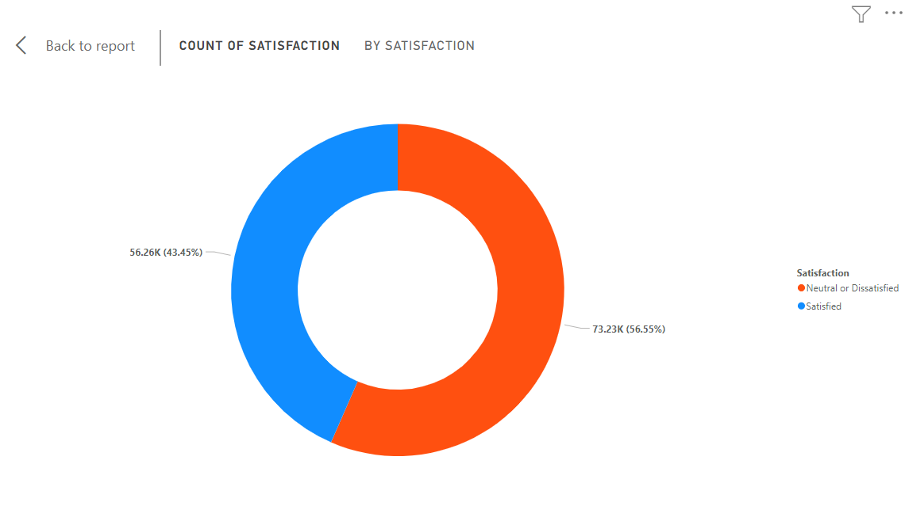
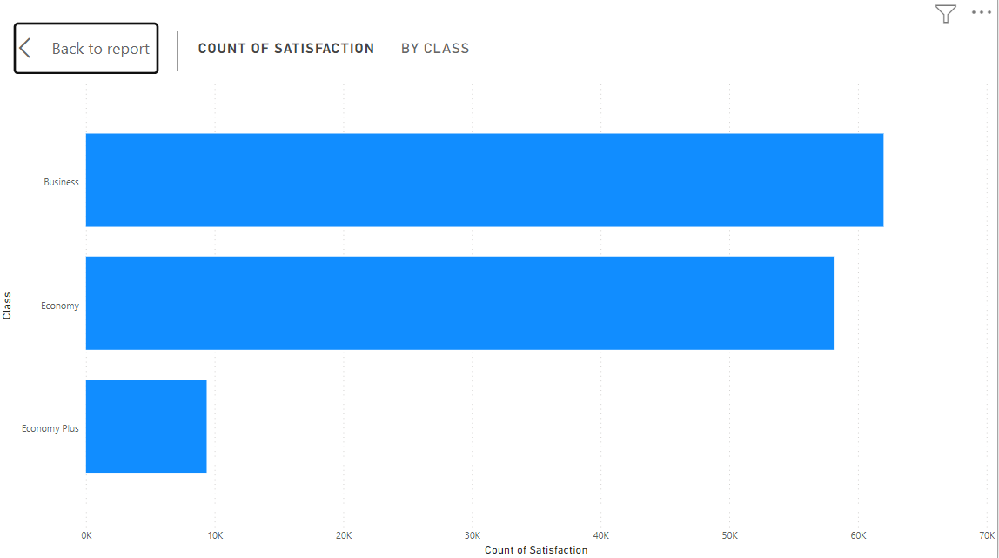
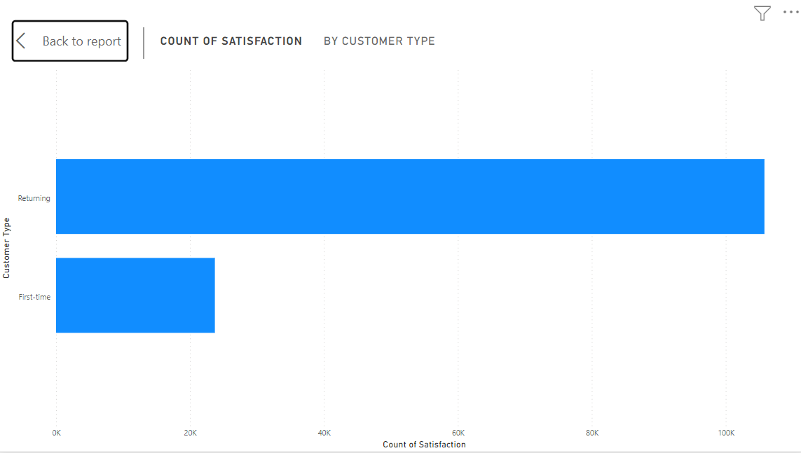
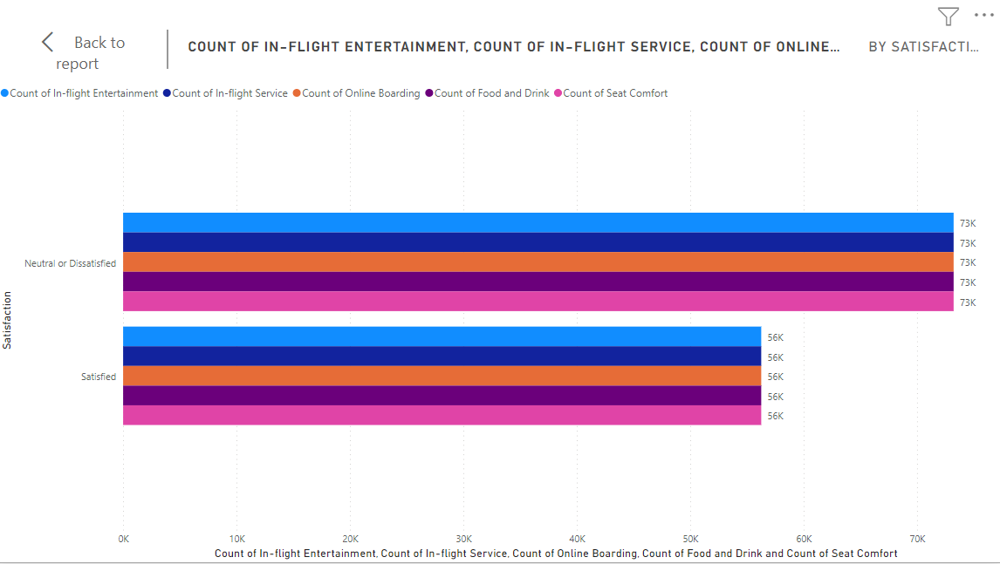

# Dano Airline Customer satisfacion Analysis

## Introduction 

This is a power Bi BootCamp Capstone Project on Customer Satisfaction Analysis of an assumed Uk- based airline headquartered in London, United Kingdom called Dano Airline.
The capstone project is to assume the role of a data analyst for Dano Airline and analyse the latest passenger survey which shows that the satisfaction rate dropped by 50% for the first time ever and also find key areas to focus on for getting back on track.

## Problem Statement:

1. What are the numbers of people who were Neutral or Dissatisfied and Satisfied respectively?
2. What class of ticket were satisfied and Neutral or Dissatisfied.
3. Which of the set of Customers were more satisfied: Returning or First timers ?
4. Which areas/services should be focused on in order to get back on track? 

## Visualization:

The report is a pager consisting of:
1. Customer Satisfaction chart
2. Class of Tickets
3. Type of Customers
4. Heads of services provided with satisfaction rate

## Analysis:

### Customer Satisfaction Chart:

56.55% of customers are Neutral or dissatsified with Dano Ailine's services
43.45% of customers are satisfied Dano Ailine's services

### Class Of Tickets:

Business Class Customers have the most satisfaction level followed by the Economy Class while the Economy Plus class have the least satisfaction.!

### Type of Customers

We have more returning customers than First-Time passengers

### Heads of services with satisfaction rate

All services provided by the airline such as :
1. In-Flight Entertainment;
2. Online Boarding;
3. Food and Drink;
4. Seat comfort e.t.c
Need to be looked at and made better as the data revelead customers are Neutral and Dissatisfied.

## Conclusion and Recommendations:
1. Most of the head of services have to be looked into and revamped for better customer service provision.
2. A little bit of concern/attention for Economy Plus customers will go a long way to improve the overall feedback.

## Thank you.

 
